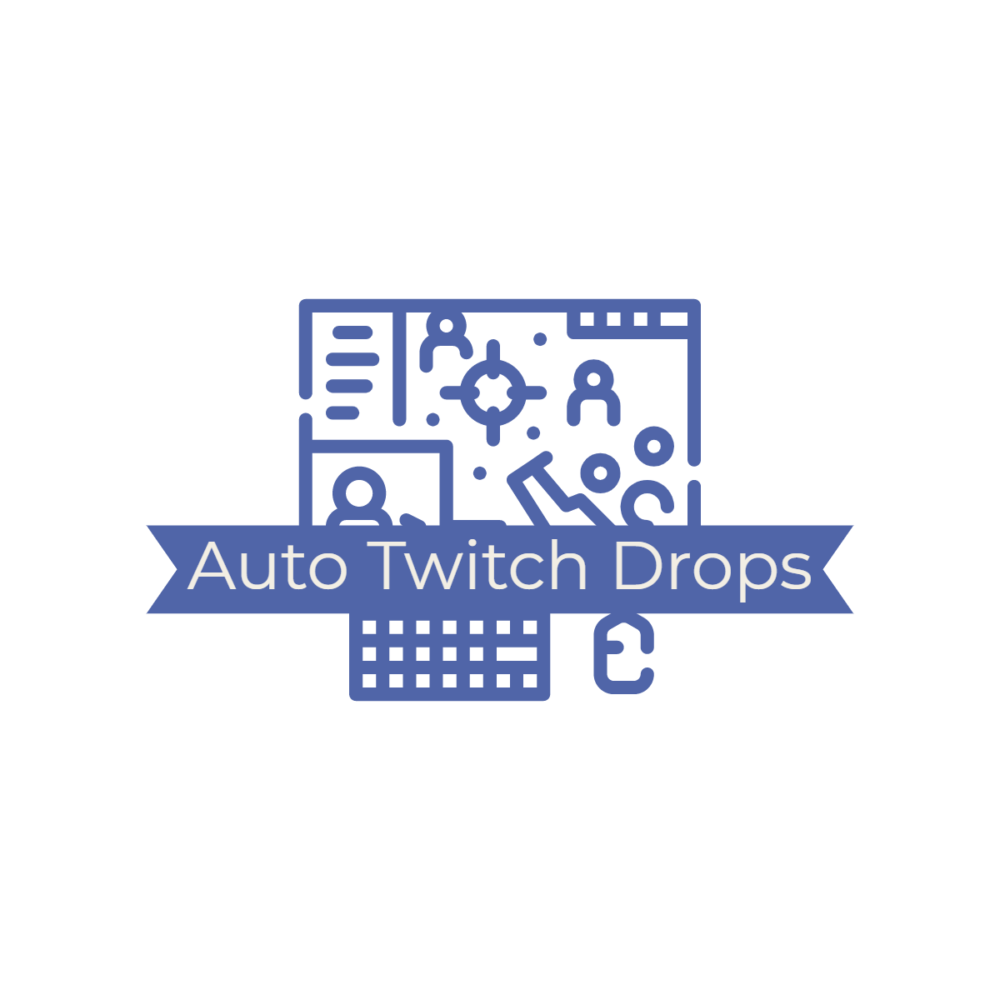

<div id="top"></div>
<!--
*** Thanks for checking out the Best-README-Template. If you have a suggestion
*** that would make this better, please fork the repo and create a pull request
*** or simply open an issue with the tag "enhancement".
*** Don't forget to give the project a star!
*** Thanks again! Now go create something AMAZING! :D
-->


<!-- PROJECT SHIELDS -->
<!--
*** I'm using markdown "reference style" links for readability.
*** Reference links are enclosed in brackets [ ] instead of parentheses ( ).
*** See the bottom of this document for the declaration of the reference variables
*** for contributors-url, forks-url, etc. This is an optional, concise syntax you may use.
*** https://www.markdownguide.org/basic-syntax/#reference-style-links
-->
[![Contributors][contributors-shield]][contributors-url]
[![Forks][forks-shield]][forks-url]
[![Stargazers][stars-shield]][stars-url]
[![Issues][issues-shield]][issues-url]
[![MIT License][license-shield]][license-url]
[![LinkedIn][linkedin-shield]][linkedin-url]


<!-- PROJECT LOGO -->
<br />
<div align="center">
  <a href="https://github.com/trevtravtrev/AutoTwitchDrops">
    
  </a>

<h3 align="center">Auto Twitch Drops</h3>

  <p align="center">
    A minimalist bot that gets Twitch drops for you written in pure Python.
    <br />
    <a href="https://github.com/trevtravtrev/AutoTwitchDrops"><strong>Explore the docs »</strong></a>
    <br />
    <br />
    <a href="https://github.com/trevtravtrev/AutoTwitchDrops">View Demo</a>
    ·
    <a href="https://github.com/trevtravtrev/AutoTwitchDrops/issues">Report Bug</a>
    ·
    <a href="https://github.com/trevtravtrev/AutoTwitchDrops/issues">Request Feature</a>
  </p>
</div>


<!-- TABLE OF CONTENTS -->
<details>
  <summary>Table of Contents</summary>
  <ol>
    <li>
      <a href="#about-the-project">About The Project</a>
      <ul>
        <li><a href="#built-with">Built With</a></li>
      </ul>
    </li>
    <li>
      <a href="#getting-started">Getting Started</a>
      <ul>
        <li><a href="#prerequisites">Prerequisites</a></li>
        <li><a href="#installation">Installation</a></li>
      </ul>
    </li>
    <li><a href="#usage">Usage</a></li>
    <li><a href="#roadmap">Roadmap</a></li>
    <li><a href="#contributing">Contributing</a></li>
    <li><a href="#license">License</a></li>
    <li><a href="#contact">Contact</a></li>
    <li><a href="#PoketDev">PoketDev (Unlimited Software Engineering Subscription)</a></li>
  </ol>
</details>


<!-- ABOUT THE PROJECT -->
## About The Project

[![Product Name Screen Shot][product-screenshot]](https://github.com/trevtravtrev/AutoTwitchDrops)


<p align="right">(<a href="#top">back to top</a>)</p>


### Built With

* [Python](https://www.python.org/)
* [Selenium](https://selenium-python.readthedocs.io/)

<p align="right">(<a href="#top">back to top</a>)</p>


<!-- GETTING STARTED -->
## Getting Started

To get a local copy up and running follow these simple steps.

### Prerequisites

If not already installed, install the following.
* [Python 3.10](https://www.python.org/downloads/)
* [Google Chrome](https://www.google.com/chrome/)


### Installation

1. Clone the repo
    ```sh
   git clone https://github.com/trevtravtrev/AutoTwitchDrops.git
    ```
2. Install requirements.txt
    ```sh
   pip3 install -r requirements.txt
    ```
   or
    ```sh
   pip install -r requirements.txt
    ```
3. Enter settings in `config.py`
   ```py
    streamer_text_file =
    browser_refresh_time =
    chrome_profile_path =
   ```
4. Enter twitch streamers in `streamers.txt` (Recommended: 20 maximum)
    ```
    A_Seagull
    adeptthebest
    Aspen
    Beaver
    chipsa
    Custa
    Deku
    Emongg
    Eviltoaster
    Flats
    Jay3
    Joystick
    Kephrii
    Kragie
    ml7support
    ```
5. Run `main.py`


<p align="right">(<a href="#top">back to top</a>)</p>

<!-- USAGE EXAMPLES -->
## Usage
1) Automate "watching" an unlimited amount of streamers to obtain any drops you desire
2) Browser tabs auto refresh (configurable) to fire up streams that have started since last refresh
3) Mute browser sound
4) Continue on with your day
5) Collect your twitch drops


<p align="right">(<a href="#top">back to top</a>)</p>

<!-- ROADMAP -->
## Roadmap

- [ ] Supporting more browsers (firefox, edge, ie, brave)
- [ ] Providing pre-built drops streamer (streamers.txt) files for popular games
- [ ] Community requested features

See the [open issues](https://github.com/trevtravtrev/AutoTwitchDrops/issues) for a full list of proposed features (and known issues).

<p align="right">(<a href="#top">back to top</a>)</p>


<!-- CONTRIBUTING -->
## Contributing

Contributions are what make the open source community such an amazing place to learn, inspire, and create. Any contributions you make are **greatly appreciated**.

If you have a suggestion that would make this better, please fork the repo and create a pull request. You can also simply open an issue with the tag "enhancement".
Don't forget to give the project a star! Thanks again!

1. Fork the Project
2. Create your Feature Branch (`git checkout -b feature/AmazingFeature`)
3. Commit your Changes (`git commit -m 'Add some AmazingFeature'`)
4. Push to the Branch (`git push origin feature/AmazingFeature`)
5. Open a Pull Request

<p align="right">(<a href="#top">back to top</a>)</p>


<!-- LICENSE -->
## License

Distributed under the MIT License. See `LICENSE.txt` for more information.

<p align="right">(<a href="#top">back to top</a>)</p>


<!-- CONTACT -->
## Contact

Trevor White  
LinkedIn - [TrevorAllenWhite][linkedin-url]  
Twitter - [@trevtravtrev](https://twitter.com/trevtravtrev)  
Github - [trevtravtrev](https://github.com/trevtravtrev)  
Email: twhite42094@gmail.com  

Project Link: [https://github.com/trevtravtrev/AutoTwitchDrops](https://github.com/trevtravtrev/AutoTwitchDrops)

<p align="right">(<a href="#top">back to top</a>)</p>


<!-- POKET DEV -->
## Poket Dev
[PoketDev.com](https://www.PoketDev.com) (coming soon)  
PoketDev@gmail.com  
Unlimited software engineering subscription. Reinventing scaling your business. No contract, no hassle, flat fee, monthly subscription with no hidden fees or surprises.
* Unlimited code request queue
* Unlimited revisions
* Unlimited team member access
* Eloquently written code
* Carefully documented
* All code written in house
* Pause or cancel anytime


<!-- MARKDOWN LINKS & IMAGES -->
<!-- https://www.markdownguide.org/basic-syntax/#reference-style-links -->
[contributors-shield]: https://img.shields.io/github/contributors/trevtravtrev/AutoTwitchDrops.svg?style=for-the-badge&logo=appveyor
[contributors-url]: https://github.com/trevtravtrev/AutoTwitchDrops/graphs/contributors
[forks-shield]: https://img.shields.io/github/forks/trevtravtrev/AutoTwitchDrops.svg?style=for-the-badge&logo=appveyor
[forks-url]: https://github.com/trevtravtrev/AutoTwitchDrops/network/members
[stars-shield]: https://img.shields.io/github/stars/trevtravtrev/AutoTwitchDrops.svg?style=for-the-badge&logo=appveyor
[stars-url]: https://github.com/trevtravtrev/AutoTwitchDrops/stargazers
[issues-shield]: https://img.shields.io/github/issues/trevtravtrev/AutoTwitchDrops.svg?style=for-the-badge&logo=appveyor
[issues-url]: https://github.com/trevtravtrev/AutoTwitchDrops/issues
[license-shield]: https://img.shields.io/github/license/trevtravtrev/AutoTwitchDrops.svg?style=for-the-badge&logo=appveyor
[license-url]: https://github.com/trevtravtrev/AutoTwitchDrops/blob/main/LICENSE
[linkedin-shield]: https://img.shields.io/badge/-LinkedIn-black.svg?style=for-the-badge&logo=linkedin&colorB=555
[linkedin-url]: https://linkedin.com/in/trevorallenwhite
[product-screenshot]: images/screenshot.png